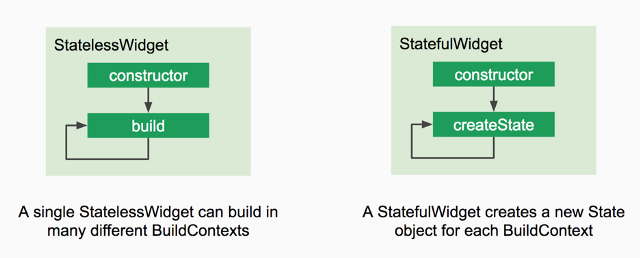

# StatelessWidget VS StatefulWidget
[What is the relation between stateful and stateless widgets in Flutter?](https://stackoverflow.com/questions/47501710/what-is-the-relation-between-stateful-and-stateless-widgets-in-flutter)

___


> 1

一个 [StatelessWidget](https://docs.flutter.io/flutter/widgets/StatelessWidget-class.html) 永远不会自己rebulid (但是会因为外部事件rebuild).而 [StatefulWidget](https://docs.flutter.io/flutter/widgets/StatefulWidget-class.html) 会。

但是任何类型的Widget都可以在任何事件重绘repainted。

StatelessWidget仅表示其所有属性都是不可变的，并且更改它们的唯一方法是重建建该Widget的新实例。

> 2

**StatefulWidget vs StatelessWidget.**



**StatelessWidget** -- 一个不需要可变state的Widget

当您要构建的用户界面部分不依赖于对象本身的配置信息，你可以用statelessWidget。 对于有可以动态变化的成分，例如 由于具有内部时钟驱动状态，或取决于某些系统状态，请考虑使用 StatefulWidget。

```dart
class GreenFrog extends StatelessWidget {
  const GreenFrog({ Key key }) : super(key: key);

  @override
  Widget build(BuildContext context) {
    return Container(color: const Color(0xFF2DBD3A));
  }
}
```

**StatefulWidget** -- 一个有可变state的Widget

当你需要构建的交互可以动态改变的时候用Stateful widgets

当Flutter构建`StatefulWidget`时，它会创建一个State对象。 该对象是用以保留该Widget的所有可变状态。

状态的定义有两个原则

1）Widget使用的数据可能会更改。

2）构建Widget时，无法同步读取数据。 （必须在调用build方法时建立所有状态）。

> 

**StatefulWidget lifecycle**

The lifecycle has the following simplified steps:

1. **createState()** -- When Flutter is instructed to build a StatefulWidget, it immediately calls `createState()`.

> - Creates the mutable state for this widget at a given location in the tree.
> - Subclasses should override this method to return a newly created instance of their associated State subclass:

```dart
@override
_MyState createState() => _MyState();
```

1. **mounted == true** -- All widgets have a bool `this.mounted` property. It turns true when the `buildContext` is assigned. It is an error to call `setState` when a widget is unmounted. Whether this State object is currently in a tree.

> - After creating a State object and before calling `initState`, the framework "mounts" the State object by associating it with a
>   `BuildContext`. The State object remains mounted until the framework
>   calls `dispose()`, after which time the framework will never ask the
>   State object to build again.
> - It is an error to call setState unless mounted is true.

```dart
bool get mounted => _element != null;
```

1. **initState()** -- This is the first method called when the widget is created (after the class constructor, of course.)

```
initState` is called once and only once. It must call `super.initState().
```

> - Initialize data that relies on the specific BuildContext for the created instance of the widget.
> - Initialize properties that rely on these widgets ‘parent’ in the tree.
> - Subscribe to Streams, `ChangeNotifiers`, or any other object that could change the data on this widget.

```dart
@override
initState() {
  super.initState();
  // Add listeners to this class
  cartItemStream.listen((data) {
    _updateWidget(data);
  });
}
```

1. **didChangeDependencies()** -- Called when a dependency of this State object changes.

> - This method is also called immediately after `initState`. It is safe to call `BuildContext.inheritFromWidgetOfExactType` from this method.
> - Subclasses rarely override this method because the framework always calls build after dependency changes. Some subclasses do override this method because they need to do some expensive work (e.g., network fetches) when their dependencies change, and that work would be too expensive to do for every build.

```dart
@protected
@mustCallSuper
void didChangeDependencies() { }
```

1. **build()** -- Describes the part of the user interface represented by the widget.

The framework calls this method in a number of different situations:

- After calling `initState`.
- After calling `didUpdateWidget`.
- After receiving a call to `setState`.
- After a dependency of this State object changes (e.g., an InheritedWidget referenced by the previous build changes).
- After calling deactivate and then reinserting the State object into the tree at another location.

> - The framework replaces the subtree below this widget with the widget returned by this method, either by updating the existing subtree or by removing the subtree and inflating a new subtree, depending on whether the widget returned by this method can update the root of the existing subtree, as determined by calling `Widget.canUpdate`.
> - Typically implementations return a newly created constellation of widgets that are configured with information from this widget's constructor, the given [BuildContext](https://stackoverflow.com/questions/49100196/what-does-buildcontext-do-in-flutter/54510497#54510497), and the internal state of this State object.

```dart
@override
  Widget build(BuildContext context, MyButtonState state) {
    ... () { print("color: $color"); } ...
  }
```

1. **didUpdateWidget()** -- Called whenever the widget configuration changes.

> - If the parent widget rebuilds and request that this location in the tree update to display a new widget with the same runtime type and Widget.key, the framework will update the widget property of this State object to refer to the new widget and then call this method with the previous widget as an argument.
> - Override this method to respond when the widget changes (e.g., to start implicit animations).
> - The framework always calls build after calling didUpdateWidget, which means any calls to setState in didUpdateWidget are redundant.

```dart
@mustCallSuper
@protected
void didUpdateWidget(covariant T oldWidget) { }
```

1. **setState()** -- Whenever you change the internal state of a State object, make the change in a function that you pass to `setState`:

> - Calling **setState** notifies the framework that the internal state of this object has changed in a way that might impact the user interface in this subtree, which causes the framework to schedule a build for
>   this State object.
> - If you just change the state directly without calling **setState**, the framework might not schedule a build and the user interface for this subtree might not be updated to reflect the new state.

```dart
setState(() { _myState = newValue });
```

1. **deactivate()** -- Deactivate is called when State is removed from the tree, but it might be reinserted before the current frame change is finished. This method exists basically because State objects can be moved from one point in a tree to another.

> - The framework calls this method whenever it removes this State object from the tree. In some cases, the framework will reinsert the State object into another part of the tree (e.g., if the subtree containing this State object is grafted from one location in the tree to another). If that happens, the framework will ensure that it calls build to give the State object a chance to adapt to its new location in the tree. If the framework does reinsert this subtree, it will do so before the end of the animation frame in which the subtree was removed from the tree. For this reason, State objects can defer releasing most resources until the framework calls their dispose method.

This is rarely used.

```dart
@protected
@mustCallSuper
void deactivate() { }
```

1. **dispose()** -- Called when this object is removed from the tree permanently.

> - The framework calls this method when this State object will never build again. After the framework calls `dispose()`, the State object is considered unmounted and the mounted property is false. It is an error to call setState at this point. This stage of the lifecycle is terminal: there is no way to remount a State object that has been disposed of.
> - Subclasses should override this method to release any resources retained by this object (e.g., stop any active animations).

```dart
@protected
@mustCallSuper
void dispose() {
  assert(_debugLifecycleState == _StateLifecycle.ready);
  assert(() { _debugLifecycleState = _StateLifecycle.defunct; return true; }());
}
```

[](https://i.stack.imgur.com/zzElL.png)

