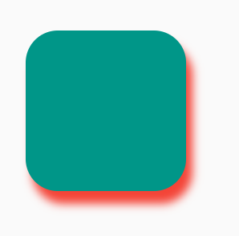

# 如何给Widget添加阴影？
[How can I add shadow to the widget in flutter?](https://stackoverflow.com/questions/52227846/how-can-i-add-shadow-to-the-widget-in-flutter)

___


> 1

使用BoxDecoration和boxShadow

```dart
return Container(
  margin: EdgeInsets.only(left: 30, top: 100, right: 30, bottom: 50),
  height: double.infinity,
  width: double.infinity,
  decoration: BoxDecoration(
    color: Colors.white,
    borderRadius: BorderRadius.only(
      topLeft: Radius.circular(10),
        topRight: Radius.circular(10),
        bottomLeft: Radius.circular(10),
        bottomRight: Radius.circular(10)
    ),
    boxShadow: [
      BoxShadow(
        color: Colors.grey.withOpacity(0.5),
        spreadRadius: 5,
        blurRadius: 7,
        offset: Offset(0, 3), // changes position of shadow
      ),
    ],
  ),
)
```


> 2

使用**`PhysicalModel`:**

```dart
PhysicalModel(
  color: Colors.teal,
  elevation: 8,
  shadowColor: Colors.red,
  borderRadius: BorderRadius.circular(20),
  child: SizedBox(width: 100, height: 100),
)
```

