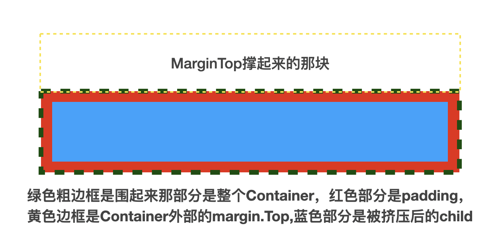

# 布局
> 1

Margin外边距

Padding内边距，挤压child的空间

```
 Container(
        color: Colors.red,
        height: 50,
        padding: EdgeInsets.all(10), // 红色外围部分
        margin: EdgeInsets.only(top: 40), // 黄色框部分
        child: Container(
          color: Colors.blue, // 蓝色块
        ),
      ),
```




