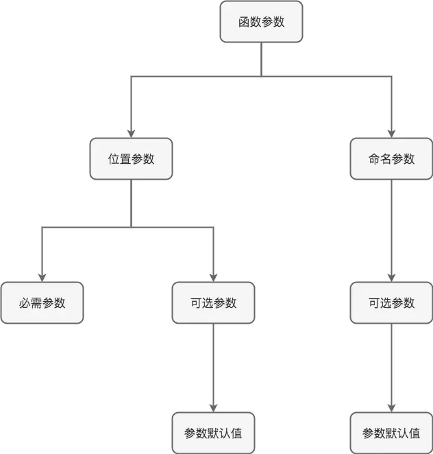

# 参数问题

> 1

此外在Dart中函数参数大致可分为两种: **位置参数和命名参数**，来一张图理清它们的概念关系



#### 1、位置参数

**位置参数可以必需的也可以是可选**。

- 无参数

```
//无参数类型-这是不带函数参数或者说参数列表为空
String getDefaultErrorMsg() => 'Unknown Error!';
//无参数类型-等价于上面函数形式，同样是参数列表为空
get getDefaultErrorMsg => 'Unknown Error!';
```

- 必需位置参数

```
//必需位置参数类型-这里的exception是必需的位置参数
String getErrorMsg(Exception exception) => exception.toString();
```

- 可选位置参数-中括号括起来表示

```
//注意: 可选位置参数是中括号括起来表示，例如[String error]
String getErrorMsg([String error]) => error ?? 'Unknown Error!';
```

- 必需位置参数和可选位置参数混合

```
//注意: 可选位置参数必须在必需位置参数的后面
String getErrorMsg(Exception exception, [String extraInfo]) => '${exception.toString()}---$extraInfo';
```

#### 2、命名参数

命名参数**始终是可选参数**。为什么是命名参数，这是因为在调用函数时可以任意指定参数名来传参。

- 可选命名参数

```
//注意: 可选命名参数是大括号括起来表示，例如{num a, num b, num c, num d}
num add({num a, num b, num c, num d}) {
   return a + b + c + d;
}
//调用
main() {
   print(add(d: 4, b: 3, a: 2, c: 1));//这里的命名参数就是可以任意顺序指定参数名传值,例如d: 4, b: 3, a: 2, c: 1
}
```

- 必需位置参数和可选命名参数混合

```
//注意: 可选命名参数必须在必需位置参数的后面
num add(num a, num b, {num c, num d}) {
   return a + b + c + d;
}
//调用
main() {
   print(add(4, 5, d: 3, c: 1));//这里的命名参数就是可以任意顺序指定参数名传值,例如d: 3, c: 1,但是必需参数必须按照顺序传参。
}
```

- 注意: 可选位置参数和可选命名参数不能混合在一起使用，因为可选参数列表只能位于整个函数形参列表的最后。

```
void add7([num a, num b], {num c, num d}) {//非法声明，想想也没有必要两者一起混合使用场景。所以
   ...
}
复制代码
```

#### 3、关于可选位置参数`[num a, num b]`和可选命名参数`{num a, num b}`使用场景

可能问题来了，啥时候使用可选位置参数，啥时候使用可选命名参数呢?

这里给个建议: **首先，参数是非必需的也就是可选的，如果可选参数个数只有一个建议直接使用可选位置参数`[num a, num b]`；如果可选参数个数是多个的话建议用可选命名参数`{num a, num b}`.** 因为多个参数可选，指定参数名传参对整体代码可读性有一定的增强。

#### 4、参数默认值(针对可选参数)

首先，需要明确一点，参数默认值只针对可选参数才能添加的。可以使用 **=** 来定义命名和位置参数的默认值。**默认值必须是编译时常量。如果没有提供默认值，则默认值为null**。

- 可选位置参数默认值

```
num add(num a, num b, num c, [num d = 5]}) {//使用=来赋值默认值
    return a + b + c + d;
}
main() {
    print(add(1, 2, 3));//有默认值参数可以省略不传 实际上求和结果是: 1 + 2 + 3 + 5(默认值)
    print(add(1, 2, 3, 4));//有默认值参数指定传入4，会覆盖默认值，所以求和结果是: 1 + 2 + 3 + 4
}
```

- 可选命名参数默认值

```
num add({num a, num b, num c = 3, num d = 4}) {
    return a + b + c + d;
}
main() {
    print(add(100, 100, d: 100, c: 100));    
}
```

