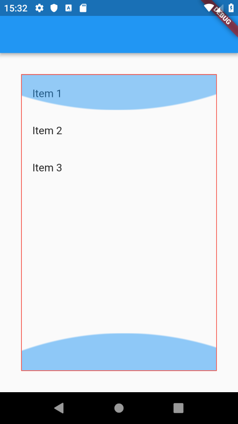
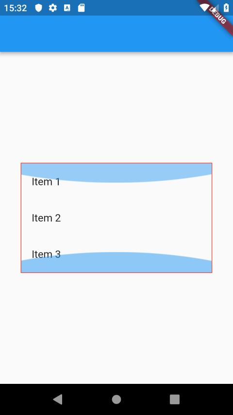

# shrinkWrap属性是做什么用的

[What does the shrink wrap property do in flutter?](https://stackoverflow.com/questions/54007073/what-does-the-shrink-wrap-property-do-in-flutter)

> 1

一般情况下，ListView(GridView/PageView/CustomScrollView)都会试图填满父element给的空间，哪怕是list items无需这么多空间。

使用shrinkWrap: true，你就可以使得ListView只会占满所需要的空间。

```
import 'package:flutter/material.dart';

void main() => runApp(App());

class App extends StatelessWidget {
  @override
  Widget build(BuildContext context) {
    return MaterialApp(
      home: Scaffold(
        appBar: AppBar(),
        body: Center(
          child: Container(
            margin: EdgeInsets.all(32),
            decoration: BoxDecoration(border: Border.all(color: Colors.red)),
            child: ListView(
              shrinkWrap: false,
              children: <Widget>[
                ListTile(title: Text('Item 1')),
                ListTile(title: Text('Item 2')),
                ListTile(title: Text('Item 3')),
              ],
            ),
          ),
        ),
      ),
    );
  }
}
```

`shrinkWrap: false`是这样的:



`shrinkWrap: true`是这样的:




> 2

如果你不设置shrinkWrap属性，你的ListView就会和它的父widget一样大；

如果你设置shrinkWrap属性为true，那么listView会包裹它的内容，使得大小根据children来决定

